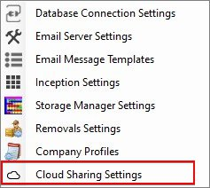
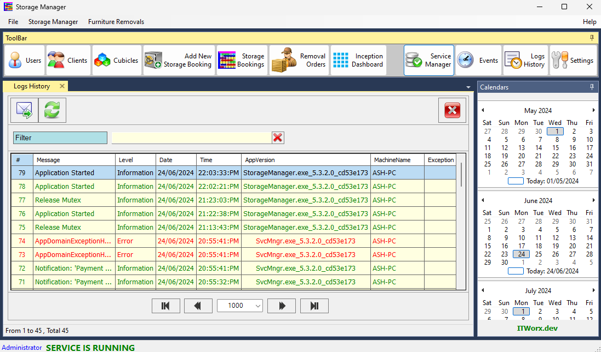

### Version 6.6.0 (24-10-2025)
##### <li class="red-text">Minor bug fix.</li>
##### <li class="green-text">Libraries and Security updates.</li>
##### <li class="green-text">Stability and Performance improvements.</li>

---

### Version 6.5.7 (08-08-2025)
##### <li class="green-text">Performance improvements.</li></li>

---

### Version 6.5.6 (01-08-2025)
##### <li class="red-text">Fixed issue of normalizing cubicle ledger in group booking, now each cubicle will have its own ledger without settlement transactions.</li>

---

### Version 6.5.5 (17-06-2025)
##### <li class="red-text">Fixed issues in Due Payment settlement of Storage Group Booking when adding a partial payment.</li>
##### <li class="red-text">Minor bug fix.</li>
##### <li class="green-text">New Feature: Adding Group Booking Statement report generator button.</li>
##### <li class="green-text">Minor stability improvements.</li>

---

### Version 6.5.0 (16-05-2025)
##### <li class="red-text">Fixed issues in Storage Booking Due Payment settlement.</li>

---

### Version 6.4.9 (12-05-2025)
##### <li class="red-text">Fixed an issue in the Move-Out Statement where refund or charge amounts were incorrect.</li>

---

### Version 6.4.8 (19-03-2025)
##### <li class="red-text">Minor fix for Next Due Date in the payment request when generating a payment request before the original due date.</li>

---

### Version 6.4.7 (17-03-2025)
##### <li class="red-text">Minor fix for Next Due Date in the payment request and ledger records.</li>

---

### Version 6.4.5 (05-03-2025)
##### <li class="red-text">Minor automatic notification dispatching bug fix.</li>

---

### Version 6.4.4 (02-03-2025)
##### <li class="red-text">Minor bug fix.</li>
##### <li class="green-text">Stability improvements.</li>

---

### Version 6.4.2 (28-02-2025)
##### <li class="green-text">New Feature: We’ve introduced a new Dashboard screen that allows users to configure their NextCloud and Bitly credentials.

This enhancement enables seamless attachment hosting and efficient link shortening when sending SMS messages to clients.

🔹 NextCloud Integration – Securely store attachments uploaded for SMS messages.

🔹 Bitly Integration – Automatically shorten URLs for a cleaner and more professional message format.

🔹 User-Friendly Setup – Easily manage cloud credentials and API keys through the new Dashboard screen.

This update improves the efficiency and reliability of sending SMS messages with attachments while keeping links short and accessible.</li>

---

### Version 6.4.1 (27-02-2025)
##### <li class="green-text">New Feature: Allow the user to append a selected message template to the SMS attachment links content.</li>

---

### Version 6.4.0 (26-02-2025)
##### <li class="green-text">New Feature: Send SMS notifications with attachments included as embedded links for easy access.</li>

---

### Version 6.3.28 (25-02-2025)
##### <li class="green-text">New Feature: Find Storage Booking by Client's phone number.</li>

---

### Version 6.3.26 (12-02-2025)
##### <li class="red-text">Minor bug fix.</li>
##### <li class="green-text">Stability improvements.</li>

---

### Version 6.3.25 (09-02-2025)
##### <li class="red-text">🛠 Fixed an issue where the sender's provider profile was not retrieved correctly when editing a Storage Quote message.</li>
##### <li class="green-text">✨ Enhanced the visibility of the Storage booking period by displaying it in a larger, red-colored font to make it more noticeable.</li>
---

### Version 6.3.23 (01-02-2025)
##### <li class="red-text">Minor bug fix in the Storage Payment Request Due Date.</li>

---

### Version 6.3.22 (30-01-2025)
##### <li class="red-text">Fixed: Adjusted the payment request due date to correctly handle cases where the booking balance is negative due to a previous partial payment.</li>

---

### Version 6.3.21 (29-01-2025)
##### <li class="red-text">Minor bug fix.</li>
##### <li class="green-text">Stability improvements.</li>

---

### Version 6.3.20 (27-01-2025)
##### <li class="red-text">Improved user experience when closing the Removal Quote Request screen: it now correctly redirects back to the Removals screen, rather than any other active screens.</li>

---

### Version 6.3.17 (22-01-2025)
##### <li class="green-text">New Feature: Users can now designate any workstation to operate in "Server Mode".   When a workstation is switched to "Server Mode", the previously designated server workstation will automatically transition to "Terminal Mode" for seamless operation.  This feature is especially useful when the workstation currently in "Server Mode" becomes remote or inaccessible, allowing users to maintain control and ensure uninterrupted workflow.</li>
##### <li class="red-text">Fix a minor bug and stability important.</li>

---

### Version 6.3.14 (17-01-2025)
##### <li class="green-text">Feature added: Users can now rename price schemes without duplicating records, provided the price values remain unchanged. This feature helps organize existing price schemes with undesired naming conventions.</li>
##### <li class="green-text">Feature added: Users can delete price schemes that are not associated with any existing storage bookings in Confirmed, Unconfirmed, or Moved-Out statuses.</li>
##### <li class="green-text">Feature added: The Prices list now displays timestamps to inform users of the last date and time a price scheme was modified.</li>

---

### Version 6.3.13 (16-01-2025)
##### <li class="red-text">Fixed: Issue where Confirming Removal Quote Request showing an error message and the user needs to close and open the quote again in order to be able to confirm the Removal Quote Order.</li>
##### <li class="green-text">Feature added: After confirming the Removal Quote, the users will be asked if they want to send a Job order to the booked Removalist.</li>
##### <li class="green-text">Feature added: After confirming the Removal Quote, the 'Send Job Order' button will set in green instead of pink to notify the user that the job order is ready to submit to the booked Removalist</li>
##### <li class="green-text">Feature added: Allow the user to open the message attachment file in the default Windows assosiated pdf/image viewer instead of the built-in viewer, this feature is useful when the user needs to view the attached file while navigating the application screens in the same time, this feature can be reached by righ-click on the selected attachment in Message History or Send Email screens and select 'Open With...' menu item.</li>
##### <li class="green-text">Feature added: Any change to existing Storage Price scheme will be added to the log history for reference.</li>
##### <li class="green-text">Feature added: Allow user to edit existing Storage price on the fly when adding a new Storage booking without affecting any existing booking uses the same scheme name, the edited price will be automatically duplicated and assigned to the new booking.</li>
##### <li class="green-text">Feature added: Adding a Price Scheme name to the Storage Booking Edit screen to make it easy for the user to know what price scheme used with the edited booking record.</li>

---

### Version 6.3.12 (14-01-2025)
##### <li class="red-text">Fixed: Issue where Removals Tags were not updated until close and re-open Removals Screen.</li>

---

### Version 6.3.11 (13-01-2025)
##### <li class="red-text">Fixed: Central Service will stop Updating Inception events if the internet connection is lost and the user will have to restart the service in order to resume getting the updates.</li>
##### <li class="red-text">Fixed: Improved the search functionality on all screens to prevent undesired results from appearing while typing. Now, auto-search will only be triggered after 5 seconds of inactivity, allowing for faster and more accurate typing.</li>
##### <li class="green-text">Set the default search category to 'Any' in the Removals screen.</li>

---

### Version 6.3.7 (12-01-2025)
##### <li class="red-text">Fixed: Issue where the progress of Inception Events Recovery wasn't displayed correctly when started manually.</li>

---

### Version 6.3.6 (12-01-2025)
##### <li class="red-text">Fixed: Issue in saving unconfirmed Removal Quote including a Follow-up template.</li>

---

### Version 6.3.5 (10-01-2025)
##### <li class="red-text">Fixed: Issue with updating Inception events.</li>
##### <li class="green-text">New Feature: Added a checkbox to the Inception Events screen, enabling users to manually download and recover missing Inception events when the remote application service is down or unreachable.</li> 

---

### Version 6.3.4 (29-12-2024)
##### <li class="green-text">Application stability and performance improvements.</li> 
##### <li class="red-text">Minor bug fixes.</li> 

---

### Version 6.3.2 (20-12-2024)
##### <li class="red-text">Resolved an issue in application cache service.</li> 

---

### Version 6.3.1 (019-12-2024)
##### <li class="green-text">Allow caching all sent and received messages and its attachments on the local computer to improve accessing messages history performance.</li>
##### <li class="green-text">Allow the user to edit any historical ledger transaction from booking ledger screen or from general ledger screen.</li>
##### <li class="green-text">Add option to search by payment method in general ledger screen.</li>
##### <li class="green-text">Add a checkbox to enable/disable receiving emails from selected email providers settings screen.</li>
##### <li class="green-text">Add message size column in MB to Received messages screen.</li>
##### <li class="red-text">Resolved an issue of downloading messages from email server provider not attached to a registered company profile.</li>

---

### Version 6.2.2 (06-12-2024)
##### <li class="red-text">Resolved an issue sending Storage Quotation to an unconfirmed booking client.</li> 

---

### Version 6.2.1 (06-12-2024)
##### <li class="green-text">Added functionality to enable users to send quotation requests to selected service providers based on removal requests received from customers. A dedicated and customizable message template will be automatically applied to the outgoing quotation request.</li> 
##### <li class="green-text">All correspondence with service providers is now saved in the message history table for future reference.</li> 
##### <li class="green-text">AlUsers can send quotation requests to multiple service providers in a single action, streamlining the process.</li> 

---

### Version 6.1.7 (02-12-2024)
##### <li class="red-text">Fix an issue where received messages without a specified or matching addressee in the existing email configuration usernames were not properly displayed.</li> 

---

### Version 6.1.5 (28-11-2024)
##### <li class="green-text">Added a notification label on the Main App Screen to display the number of unread messages and removal quotes. Users can directly open the desired screen by clicking the notification label.</li>
##### <li class="red-text">Fixed an issue where the Inception Events screen was not updating when a new event was added until the user closed and reopened the screen.</li>
##### <li class="red-text">Fixed an issue where opening a message in the inbox would fail if it had been deleted from the mail server. The app now removes such messages from the inbox list to prevent this problem.</li>

---

### Version 6.1.4 (27-11-2024)
##### <li class="green-text">Improved email connectivity to ensure the application works seamlessly, even in cases where certificate validation issues previously caused interruptions.</li>
 
---

### Version 6.1.2 (27-11-2024)
##### <li class="green-text">User Interface enhancements and Stability improvements.</li>
 
---

### Version 6.1.1 (27-11-2024)
##### <li class="red-text">Minor bug fix.</li>
##### <li class="green-text">Stability improvements.</li>
 
---

### Version 6.1.0 (26-11-2024)
1. **Microsoft 365 Integration**:
   - Introduced the ability for the application to connect to Microsoft 365 accounts and download inbox messages seamlessly. Users can now configure their Microsoft 365 email accounts within the app for streamlined communication.

2. **Automated Message Retrieval**:
   - Enhanced the application service to periodically and automatically check for new messages from each configured Microsoft 365 inbox, ensuring users are always up-to-date with their communications.

3. **Message View and Reply**:
   - Users can now view received messages directly within the application and reply to them using the same email configuration from which the messages were received, ensuring consistency in email threads.

4. **Unread and Read Message Management**:
   - Newly downloaded messages are marked as "Unread" by default, maintaining a clear distinction for unreviewed emails.
   - Messages are automatically marked as "Read" once opened by the user.
   - Users can re-mark any "Read" messages as "Unread" for better organization and tracking of important emails.
 
---

### Version 6.0.2 (20-11-2024)
##### <li class="green-text">Allow user to edit client's record from Storage Bookings screen.</li>
##### <li class="green-text">Show Balance of the Storage Booking Expenses Ledger on the Bookings screen.</li>
##### <li class="green-text">Calculate and display the equivalent unpaid days corresponding to the payment value in the payment request invoice.</li>

---

### Version 6.0.1 (19-11-2024)
##### <li class="green-text">Allow user to unconditionally delete expense transactions.</li>
##### <li class="green-text">Add Expense button to Storage Bookings ledger screen.</li>
##### <li class="green-text">Minor performance improvements.</li>

---

### Version 6.0.0 (18-11-2024)
##### <li class="green-text">Add Purchase and Expense feature to the booking Ledger.</li>

---

### Version 5.21.0 (15-11-2024)
##### <li class="green-text">Add a new feature to allow the user to chabge the booking period type when editing the confirmed booking record.</li>

---

### Version 5.20.7 (06-11-2024)
##### <li class="red-text">Resolved an issue where the available days for a booked cubicle were not updating correctly when moving to the next page on the Storage Booking screen. The system would default to the previously selected item, causing the newly selected item to display incorrect available days information.</li>

---

### Version 5.20.6 (05-11-2024)
##### <li class="red-text">Resolved issue in loading Storage Booking records after installing new updated application version.</li>

---

### Version 5.20.5 (30-10-2024)
##### <li class="green-text">Application libraries update.</li>

---

### Version 5.20.3 (25-10-2024)
##### <li class="green-text">Add new feature: Display the exact number of available days based on the client's ledger balance and outstanding payments.</li>

---

### Version 5.20.2 (24-10-2024)
##### <li class="green-text">Application libraries update.</li>
##### <li class="green-text">Performance improvements.</li>

---

### Version 5.20.0 (20-10-2024)
##### <li class="red-text">Resolved an issue generating invoice and receipt for a newly added group booking after finalizing the booking payment.</li>

---

### Version 5.19.8 (18-10-2024)
##### <li class="green-text">Integrated with the new Database cloud based Server.</li>
##### <li class="green-text">Overall application performance improvements.</li>
##### <li class="red-text">Minor bug fixes.</li>

---

### Version 5.19.7 (18-10-2024)
##### <li class="green-text">Added a feature to archive sent Unconfirmed Storage Quotes into the Message History.</li>
##### <li class="red-text">Resolved an issue where client details were not properly retrieved when editing Unconfirmed Storage Bookings.</li>

---

### Version 5.19.6 (17-10-2024)
##### <li class="red-text">Fixed an issue where creating a new booking for a new client caused a conflict if the client's name was already in use by an existing client.</li>
##### <li class="red-text">Resolved an issue preventing the successful re-sending of messages to clients.</li>
##### <li class="red-text">Corrected an issue where newly added bookings were not adhering to the notification rules of their parent booking group.</li>

---

### Version 5.19.5 (14-10-2024)
##### <li class="red-text">Fixed the issue where storage notifications were sent without respecting the configured email redirection settings.</li>
##### <li class="red-text">Fixed the issue with manually sending billing notifications.</li>

---

### Version 5.19.4 (13-10-2024)
##### <li class="red-text">Resolved issue installing the application using update button.</li>

---

### Version 5.19.2 (13-10-2024)
##### <li class="green-text">Adding a logic to make sure only one machine act as Service server within the network to avoid racing and conflect conditions when synchronizing Inception users.</li>
##### <li class="green-text">Add New feature to copy email address from a selected row, and clear selected filter in messages History screen.</li>
##### <li class="red-text">Minor bug fix in saving unconfirmed booking.</li>

---

### Version 5.19.0 (11-10-2024)
##### <li class="green-text">Significant optimization of over all performance.</li>
##### <li class="green-text">Service Workflow: Enhanced the service logic and workflow, including handling network issues more gracefully. The service will no longer stop if a false-positive server connection issue is detected, and checks are now faster and more accurate.</li>
##### <li class="red-text">Resolved Issue causes application crash when edit notes on Removal Order screen.</li>
##### <li class="green-text">Added a feature to allow selecting email service provider before sending new message manually.</li>

---

### Version 5.18.3 (05-10-2024)
##### <li class="red-text">Fix issue loading Inception Events when slow network connection encountered.</li>
##### <li class="red-text">Fix issue Inception Settings menu Item disapeared when connected to a cloud database.</li>

---

### Version 5.18.2 (04-10-2024)
##### <li class="red-text">Resolved issues in sending payment request and reminder notifications when cloud Server is offline.</li>
##### <li class="red-text">Fix issue updating Inception status to cloud server.</li>

---

### Version 5.18.1 (03-10-2024)
##### <li class="green-text">Application is now cloud database connection-ready.</li>
##### <li class="green-text">Overall application performance improvements.</li>
##### <li class="red-text">Minor bug fixes.</li>

---

### Version 5.17.5 (27-09-2024)
##### <li class="green-text">Enhanced network performance for seamless connectivity to cloud databases.</li>
##### <li class="green-text">Introduced a network performance indicator for real-time connection monitoring.</li>

---

### Version 5.17.3 (10-09-2024)
##### <li class="green-text">Add new feature to allow balance settlement for moved out bookings.</li>
 
---

### Version 5.17.2 (09-09-2024)
##### <li class="red-text">Resolved issue in removals screen showing incorrect values in the total volume column.</li>
 
---

### Version 5.17.1 (08-09-2024)
##### <li class="red-text">Resolved issue where the Inception User status was not correctly displayed on the Bookings screen.</li>
##### <li class="red-text">Fixed issue where Payment Reminder notifications were not being sent. All pending dues will trigger a one-time notification when the fix is applied. Future notifications will work automatically as expected.</li>
 
---

### Version 5.17.0 (06-09-2024)
##### <li class="red-text">Resolved issues with refreshing the Removals and Storage screens, which were causing multiple exceptions to be logged in the application Logs History.</li>
 
---

### Version 5.16.3 (05-09-2024)
##### <li class="red-text">Improved performance and fixed issues when loading removals data.</li>
 
---

### Version 5.16.2 (24-08-2024)
##### <li class="red-text">Resolved a minor issue when searching for storage bookings by client name or number.</li>
 
---

### Version 5.16.1 [d2d6118] (21-08-2024)
##### <li class="red-text">Fix Due Date for bookings # 1645, 1433.</li>
##### <li class="green-text">Add Feature: Allow the user to manually set current and next due dates for choosen bookings</li>
 
---

### Version 5.15.13 [2c28282] (15-08-2024)
##### <li class="green-text">Improved user experience by highlighting unsent messages in red on the message history screen, making it easier to identify failed messages.</li>
##### <li class="green-text">Enhanced overall application stability and performance for a smoother and more reliable user experience.</li>

---

### Version 5.15.12 (14-08-2024)
##### <li class="red-text">Fix patch for booking #1645</li>

---

### Version 5.15.11 (13-08-2024)
##### <li class="red-text">Fix legacy issue for booking #1644.</li>
##### <li class="green-text">New Feature: Generate and attach Payment Request Invoice to every Payment Reminder and Annexure notifiaction message sent to the client
</li>

---

### Version 5.15.10 (12-08-2024)
##### <li class="red-text">Fix the Removalist order request delivery date label</li>
##### <li class="red-text">Fix search results in Bookings screen to hide the Moved-Out bookings when filter by 'Any', user will still be able to search within Moved-Out bookings when it select 'Moved-Out' in the 'filter by' dropdown list.</li>
##### <li class="green-text">Added Automated Response Template for Incomplete Quote Requests</li>

---

### Version 5.15.9 (10-08-2024)
##### <li class="red-text">Fix issue in filtering Moved-Out bookings.</li>
##### <li class="red-text">Fix Due Date for booking#1625.</li>
---
### Version 5.15.8 (09-08-2024)
##### <li class="red-text">Fix issue of wrong upcoming payment Due Date in the payment request.</li>
##### <li class="red-text">Fix legacy issue for booking #1625.</li>
---
### Version 5.15.5 [dd8cb41] (08-08-2024)
##### <li class="green-text">**Automatic Download of Removal Quote Requests**: The application now automatically downloads new removal quote requests every 5 minutes in the background. This process runs seamlessly without any user intervention.</li>
##### <li class="green-text">**Highlight New Removal Quotes**: Newly downloaded removal quotes are displayed in green until they are opened. Once opened, their color will change based on their status: unconfirmed or confirmed.</li>
##### <li class="green-text">**Miscellaneous** minor improvements for better stability and performance.</li>
##### <li class="red-text">**Fix issue** of setting a correct booking 'Due Date' when deleting recent booking ledger transactions.</li>
##### <li class="red-text">**Fix issue** when filtering bookings by pressing Client Name filter button shows no results.</li>
---
### Version 5.15.3 (07-08-2024)
##### <li class="red-text">Fix a BUG generating and dispatching a payment requests with wrong values.</li>
---
### Version 5.15.2 (05-08-2024)
##### <li class="red-text">Fix email validation issue</li>
---
### Version 5.15.0 (03-08-2024)
##### <li class="green-text">Added "Moving In filter" element to bookings screen. This will help showing all upcoming "MovingIn" bookings</li>
##### <li class="green-text">Added a new feature "MovingIn Lead Time" option to the bookings settings. This option to control showing upcoming MovingIn booking in the bookings screen before the Moving In date by specific number of days, minimum value is 1 day, and the maximum value is 14 days</li>
---
### Version 5.14.6 (02-08-2024)
##### <li class="green-text">Added a new Messages History feature to help manage and monitor all communications with clients.</li>
##### <li class="green-text">Added a feature to selectively delete messages from history, allowing the removal of old and unwanted messages to reduce database size.</li>
##### <li class="green-text">Added a feature to filter messages by client name or addressee email.</li>
##### <li class="green-text">Added a feature to re-edit and resend sent messages.</li>
---
### 
Version 5.14.5 [a3d9176] (25-07-2024) - Stable

##### <li class="red-text">Fixed an issue where creating a new booking cycle and updating the booking due date didn't work correctly when there zero (0) available days.</li>
##### <li class="green-text">External libraries update.</li>
##### <li class="green-text">Stability Improvement.</li>
---
### Version 5.14.4 (24-07-2024)
##### <li class="red-text">Bug Fix: The cash payment button in the booking toolbar now correctly displays the due balance for group bookings. Previously, it only showed the balance for a single booking, causing inaccuracies when part of a group. Now, if a selected booking is part of a group, the button will show the total due balance for the entire group.</li>
---
### Version 5.14.3 (22-07-2024)
##### <li class="green-text">Fix bookings billing date validation</li>
---
### Version 5.14.0 (20-07-2024)
##### <li class="green-text">Display booking next due date, this will help to identify upcoming due bill for the selected booking</li>
---
### Version 5.13.0 (18-07-2024)
##### <li class="green-text">Performance improvements</li>
---
### Version 5.12.4 (17-07-2024)
##### <li class="red-text">Fix an issue in deleting most recent booking ledger transaction</li>
---
### Version 5.11.0 (11-07-2024)
##### <li class="green-text">Enable the feature of adding miscellaneous charges to the booking</li>
---
### Version 5.10.2 (10-07-2024)
##### <li class="red-text">Minor bug fixes</li>
---
### Version 5.10.1 (08-07-2024)
##### <li class="red-text">Fix an issue in calcuating next booking due date for bookings have more than 1 billing cycle overdue.</li>
##### <li class="red-text">Fix an issue calculating the next booking due date if the total due amount calculated based on old cubical pricing which will result the next due date will still behind payment request date.</li>
---
### Version 5.9.0 (07-07-2024)
##### <li class="red-text">Fix severe issue of keep trying to connect to Inception device if the network connection is down, this fix to improve the stability and running service performance.</li>
##### <li class="green-text">Add feature to allow user to chose the suitable startup service stype.</li>
##### <li class="green-text">Add a featrue to disply service startup type on the application status bar</li>
##### <li class="green-text">Service performance improvement by skipping any api operation if Inception device is disabled in the app Inception settings</li>
---
### Version 5.8.2 [cdfceed] (06-07-2024)
##### <li class="green-text">Add feature of filtering logs by level Info/Error</li>
##### <li class="green-text">Enhancements to in-app viewer</li>
##### <li class="green-text">Minor performance improvements</li>
##### <li class="red-text">General Stability: Addressed miscellaneous minor bugs.</li>
##### <li class="red-text">Fixed minor bugs</li>
---
### Version 5.7.1 (05-07-2024)
##### <li class="red-text">Fix issue displaying messages histoy for group bookings</li>
---
### Version 5.6.1 (30-06-2024)
##### <li class="blue-text">Change Request: Prevent adding booking period if period due amount less than the current balance due amount.</li>
##### <li class="green-text">New Features: Open attached pdf files using in-App viewer.</li>
---
### Version 5.3.2 (27-06-2024)
##### <li class="red-text">Resolved issues with sending notifications from the svcMngr.exe service.</li>
##### <li class="red-text">Fix stopping service if sending more than 3 StorageManager notifications.</li>
##### <li class="green-text">Introduced a new Logs screen for the storage manager.</li>

 